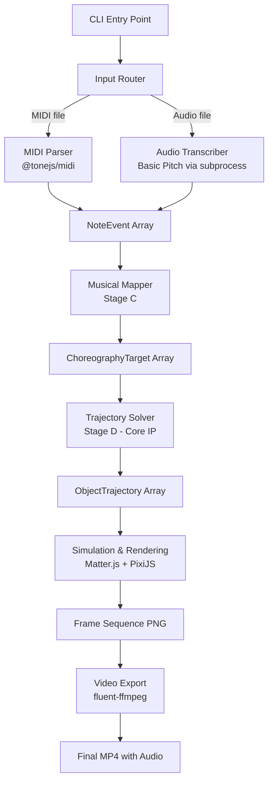
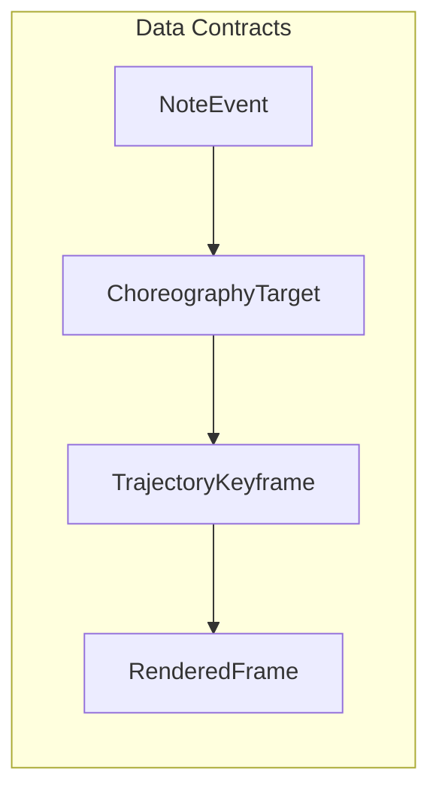
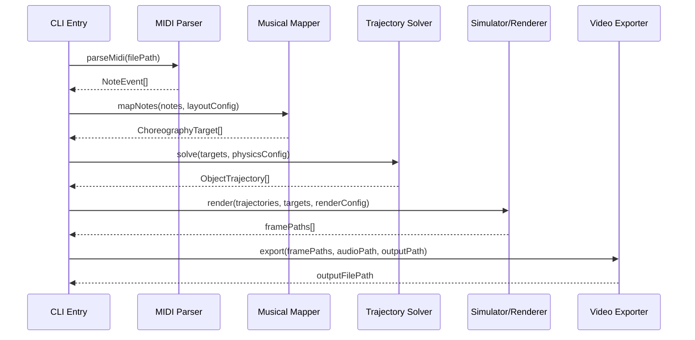
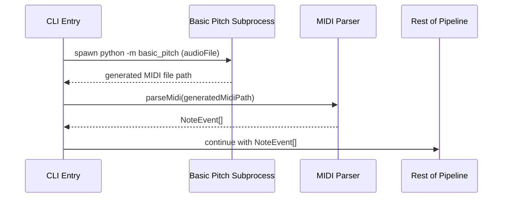
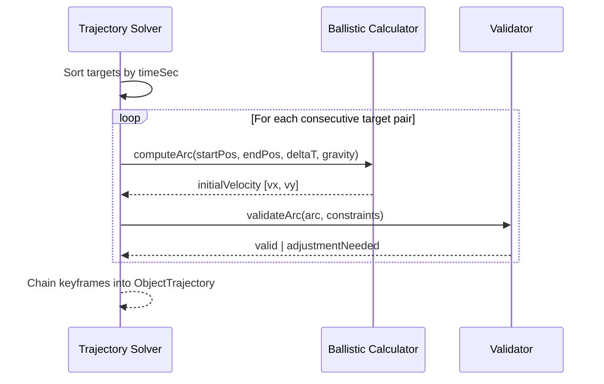

# Design Document: MotionScore — Music-to-Physics Video Generator

## Overview

MotionScore is a CLI tool that takes music (audio or MIDI) as input and produces a video where a physical object (ball/marble) moves under simulated physics, striking targets (piano keys, obstacles) in exact sync with the song's notes. The system is structured as a modular pipeline with typed data contracts between stages, enabling independent development, testing, and future extensibility (new visual styles, new input formats) without touching neighboring stages.

The core technical challenge is Stage D — the trajectory solver — which computes ballistic arcs such that an object arrives at a specific position at a specific time, chaining parabolic arcs between note hits using closed-form SUVAT kinematics. The system targets ±15ms frame-accurate sync between computed impacts and note onsets.

The CLI interface is: `motionscore input.mid -o output.mp4` (or `motionscore input.wav -o output.mp4` for audio transcription).

## Architecture





## Sequence Diagrams

### Main Pipeline Flow (MIDI Input)



### Audio Input Flow (Basic Pitch Transcription)



### Trajectory Solver Detail (Stage D)



## Components and Interfaces

### Component 1: CLI Entry Point (`packages/cli`)

**Purpose**: Parse command-line arguments, orchestrate the pipeline, handle errors.

```typescript
interface CLIOptions {
  input: string;          // path to input file (MIDI or audio)
  output: string;         // path to output video file
  fps?: number;           // target frame rate (default: 60)
  width?: number;         // video width (default: 1920)
  height?: number;        // video height (default: 1080)
  gravity?: number;       // gravity constant (default: 9.81 * pixelsPerMeter)
  layout?: 'piano-keys' | 'lanes';  // layout strategy
  verbose?: boolean;
}

interface PipelineResult {
  outputPath: string;
  stats: {
    totalNotes: number;
    renderedFrames: number;
    durationSec: number;
    maxSyncErrorMs: number;
  };
}
```

**Responsibilities**:
- Parse and validate CLI arguments
- Detect input type (MIDI vs audio) by file extension
- Orchestrate pipeline stages sequentially
- Report progress and errors

### Component 2: Note Extractor (`packages/note-extractor`)

**Purpose**: Convert input files into a normalized `NoteEvent[]` regardless of source format.

```typescript
interface NoteExtractor {
  extract(inputPath: string): Promise<NoteEvent[]>;
}

interface MidiParserOptions {
  trackFilter?: string[];   // filter to specific tracks
  velocityThreshold?: number; // ignore notes below this velocity
}

interface AudioTranscriberOptions {
  model?: 'basic-pitch';
  minNoteLength?: number;   // seconds, filter very short notes
  onsetThreshold?: number;  // confidence threshold for onset detection
}
```

**Responsibilities**:
- Detect input format and route to correct parser
- Parse MIDI files using `@tonejs/midi`
- Invoke Basic Pitch via Python subprocess for audio input
- Normalize output to `NoteEvent[]` schema
- Assign unique IDs to each note event

### Component 3: Musical Mapper (`packages/musical-mapper`)

**Purpose**: Transform note events into positioned choreography targets with layout and visual hints.

```typescript
interface MusicalMapper {
  map(notes: NoteEvent[], config: LayoutConfig): ChoreographyTarget[];
}

interface LayoutConfig {
  type: 'piano-keys' | 'lanes';
  canvasWidth: number;
  canvasHeight: number;
  targetY: number;          // y-position of the target row
  pitchRange?: [number, number]; // MIDI pitch range to map
  colorScheme?: 'chromatic' | 'circle-of-fifths';
}

interface NoteFilter {
  maxNotesPerSecond?: number;  // density threshold for thinning
  minVelocity?: number;
  trackPriority?: string[];    // prefer melody over accompaniment
}
```

**Responsibilities**:
- Map MIDI pitch to x-position (piano-key layout or lane assignment)
- Map velocity to impact size
- Map pitch to color hint (chromatic or circle-of-fifths mapping)
- Filter/thin dense passages that are too fast for physical motion
- Produce `ChoreographyTarget[]` in time-sorted order

### Component 4: Trajectory Solver (`packages/trajectory-solver`)

**Purpose**: The core IP. Compute physically-plausible ballistic arcs that hit each target at its exact time.

```typescript
interface TrajectorySolver {
  solve(targets: ChoreographyTarget[], config: SolverConfig): ObjectTrajectory;
}

interface SolverConfig {
  gravity: number;              // pixels/sec^2
  startPosition: [number, number];
  bounceRestitution?: number;   // 0-1, energy retained on bounce
  maxApexHeight?: number;       // style constraint: max arc height
  preferredArcRatio?: number;   // height-to-width ratio preference
  syncToleranceMs?: number;     // acceptable timing error (default: 15)
}

interface BallisticArc {
  startPos: [number, number];
  endPos: [number, number];
  initialVelocity: [number, number];
  duration: number;             // seconds
  apex: [number, number];       // highest point of arc
}
```

**Responsibilities**:
- Sort targets chronologically
- For each consecutive target pair, solve for initial velocity using SUVAT
- Chain arcs into a continuous trajectory
- Validate timing accuracy (within syncToleranceMs)
- Expose style parameters for arc shaping
- Generate `ObjectTrajectory` with dense keyframes for rendering

### Component 5: Simulator & Renderer (`packages/renderer`)

**Purpose**: Simulate physics frame-by-frame and render visual output using Matter.js + PixiJS.

```typescript
interface SimulatorRenderer {
  render(
    trajectory: ObjectTrajectory,
    targets: ChoreographyTarget[],
    config: RenderConfig
  ): Promise<string[]>;  // returns frame file paths
}

interface RenderConfig {
  fps: number;
  width: number;
  height: number;
  backgroundColor: string;
  ballRadius: number;
  showTrail?: boolean;
  particlesOnImpact?: boolean;
  outputDir: string;          // directory for frame PNGs
}

interface FrameState {
  frameIndex: number;
  timeSec: number;
  ballPosition: [number, number];
  ballVelocity: [number, number];
  activeTargets: string[];      // noteIds being hit this frame
  particles: ParticleState[];
}
```

**Responsibilities**:
- Initialize PixiJS renderer in headless mode (node-canvas backend)
- Step through trajectory keyframes at the configured FPS
- Interpolate ball position between keyframes
- Render targets (piano keys/lanes), ball, trails, particle effects
- Trigger impact effects when `hitsTarget` is present on a keyframe
- Export each frame as a PNG file

### Component 6: Video Exporter (`packages/video-export`)

**Purpose**: Mux rendered frame sequence with original audio into final video.

```typescript
interface VideoExporter {
  export(config: ExportConfig): Promise<string>;
}

interface ExportConfig {
  frameDir: string;         // directory containing frame PNGs
  framePattern: string;     // e.g., 'frame_%05d.png'
  audioPath: string;        // original audio file to mux
  outputPath: string;       // final output video path
  fps: number;
  codec?: string;           // default: 'libx264'
  quality?: number;         // CRF value (default: 18)
}
```

**Responsibilities**:
- Invoke ffmpeg via fluent-ffmpeg to combine frames + audio
- Handle codec selection and quality settings
- Report progress during encoding
- Clean up temporary frame files after successful export

## Data Models

### NoteEvent (Stage B Output)

```typescript
interface NoteEvent {
  id: string;               // unique identifier (e.g., 'n0001')
  pitchMidi: number;        // MIDI note number 0-127
  startSec: number;         // onset time in seconds
  endSec: number;           // offset time in seconds
  velocity: number;         // 0.0-1.0 normalized
  track?: string;           // track name (e.g., 'melody')
  instrument?: string;      // instrument name (e.g., 'piano')
}
```

**Validation Rules**:
- `pitchMidi` must be integer in [0, 127]
- `startSec` must be >= 0
- `endSec` must be > `startSec`
- `velocity` must be in [0.0, 1.0]
- `id` must be non-empty and unique within the array

### ChoreographyTarget (Stage C Output)

```typescript
interface ChoreographyTarget {
  noteId: string;           // references NoteEvent.id
  timeSec: number;          // exact time the target must be hit
  position: { x: number; y: number };  // position in world coordinates
  impactSize: number;       // 0.0-1.0, derived from velocity
  colorHint: string;        // hex color (e.g., '#4477ff')
}
```

**Validation Rules**:
- `noteId` must reference an existing NoteEvent
- `timeSec` must be >= 0 and match the referenced note's `startSec`
- `position.x` and `position.y` must be within canvas bounds
- `impactSize` must be in [0.0, 1.0]
- `colorHint` must be a valid hex color string

### TrajectoryKeyframe (Stage D Output)

```typescript
interface TrajectoryKeyframe {
  tSec: number;             // time of this keyframe
  pos: [number, number];    // [x, y] position
  vel: [number, number];    // [vx, vy] velocity
  hitsTarget?: string;      // noteId if this is an impact frame
}

interface ObjectTrajectory {
  objectId: string;         // e.g., 'ball_01'
  keyframes: TrajectoryKeyframe[];
}
```

**Validation Rules**:
- `keyframes` must be sorted by `tSec` in ascending order
- Consecutive keyframes must have `tSec` strictly increasing
- If `hitsTarget` is set, the keyframe's `tSec` must be within ±15ms of the referenced target's `timeSec`
- Velocity must be physically consistent with gravity between non-impact keyframes

## Algorithmic Pseudocode

### Core Algorithm: Ballistic Arc Solver (SUVAT)

```typescript
/**
 * SUVAT Ballistic Solver
 * 
 * Given two points and a time duration, compute the initial velocity
 * needed for a projectile under gravity to travel from start to end
 * in exactly the given time.
 * 
 * Physics: s = ut + 0.5*a*t^2
 *   Solving for u: u = (s - 0.5*a*t^2) / t
 * 
 * For x-axis (no gravity): vx = (endX - startX) / t
 * For y-axis (with gravity): vy = (endY - startY - 0.5*g*t^2) / t
 */
function computeBallisticArc(
  startPos: [number, number],
  endPos: [number, number],
  duration: number,
  gravity: number
): BallisticArc {
  // PRECONDITIONS:
  // - duration > 0
  // - gravity > 0 (downward)
  // - startPos and endPos are valid coordinates

  const [x0, y0] = startPos;
  const [x1, y1] = endPos;
  const t = duration;

  // Horizontal: uniform motion (no air resistance)
  const vx = (x1 - x0) / t;

  // Vertical: SUVAT with gravity (y-axis positive downward)
  // s = ut + 0.5*a*t^2 → u = (s - 0.5*a*t^2) / t
  const dy = y1 - y0;
  const vy = (dy - 0.5 * gravity * t * t) / t;

  // Compute apex (highest point of arc)
  // Apex time: t_apex = -vy / gravity (when vertical velocity = 0)
  const tApex = -vy / gravity;
  const apexX = x0 + vx * tApex;
  const apexY = y0 + vy * tApex + 0.5 * gravity * tApex * tApex;

  // POSTCONDITIONS:
  // - Object at startPos with [vx, vy] arrives at endPos after duration seconds
  // - Arc is a valid parabola under constant gravity

  return {
    startPos,
    endPos,
    initialVelocity: [vx, vy],
    duration: t,
    apex: [apexX, apexY],
  };
}
```

### Trajectory Chaining Algorithm

```typescript
/**
 * Chain multiple ballistic arcs into a complete trajectory.
 * 
 * PRECONDITIONS:
 * - targets sorted by timeSec ascending
 * - targets.length >= 1
 * - config.startPosition is defined
 * 
 * POSTCONDITIONS:
 * - Every target is hit within syncToleranceMs
 * - Keyframes are time-sorted and continuous
 * - Velocity is physically consistent between arcs
 * 
 * LOOP INVARIANT:
 * - After processing target[i], all targets [0..i] have corresponding
 *   impact keyframes with timing error < syncToleranceMs
 */
function solveTrajectory(
  targets: ChoreographyTarget[],
  config: SolverConfig
): ObjectTrajectory {
  const keyframes: TrajectoryKeyframe[] = [];
  let currentPos = config.startPosition;
  let currentTime = 0;

  // Add initial keyframe
  const firstArc = computeBallisticArc(
    currentPos,
    [targets[0].position.x, targets[0].position.y],
    targets[0].timeSec - currentTime,
    config.gravity
  );
  keyframes.push({
    tSec: currentTime,
    pos: currentPos,
    vel: firstArc.initialVelocity,
  });

  for (let i = 0; i < targets.length; i++) {
    const target = targets[i];
    const endPos: [number, number] = [target.position.x, target.position.y];
    const duration = target.timeSec - currentTime;

    const arc = computeBallisticArc(currentPos, endPos, duration, config.gravity);

    // Generate intermediate keyframes for smooth rendering
    const steps = Math.ceil(duration * config.fps);
    for (let step = 1; step <= steps; step++) {
      const t = (step / steps) * duration;
      const px = currentPos[0] + arc.initialVelocity[0] * t;
      const py = currentPos[1] + arc.initialVelocity[1] * t + 0.5 * config.gravity * t * t;
      const vxNow = arc.initialVelocity[0];
      const vyNow = arc.initialVelocity[1] + config.gravity * t;

      const isImpact = step === steps;
      keyframes.push({
        tSec: currentTime + t,
        pos: [px, py],
        vel: [vxNow, vyNow],
        hitsTarget: isImpact ? target.noteId : undefined,
      });
    }

    currentPos = endPos;
    currentTime = target.timeSec;
  }

  return { objectId: 'ball_01', keyframes };
}
```

### Pitch-to-Position Mapping Algorithm

```typescript
/**
 * Map MIDI pitch values to x-positions using a piano-key layout.
 * 
 * PRECONDITIONS:
 * - pitchMidi in [0, 127]
 * - canvasWidth > 0
 * - pitchRange[0] < pitchRange[1]
 * 
 * POSTCONDITIONS:
 * - Returns x in [0, canvasWidth]
 * - Monotonically increasing: higher pitch → higher x
 * - Linear mapping within the specified range
 */
function pitchToX(
  pitchMidi: number,
  canvasWidth: number,
  pitchRange: [number, number]
): number {
  const [minPitch, maxPitch] = pitchRange;
  const normalized = (pitchMidi - minPitch) / (maxPitch - minPitch);
  const clamped = Math.max(0, Math.min(1, normalized));
  return clamped * canvasWidth;
}

/**
 * Map MIDI pitch to a color using circle-of-fifths ordering.
 * 
 * PRECONDITIONS:
 * - pitchMidi in [0, 127]
 * 
 * POSTCONDITIONS:
 * - Returns a valid hex color string
 * - Same pitch class always returns same color regardless of octave
 * - Colors are perceptually distinct for adjacent pitch classes
 */
function pitchToColor(pitchMidi: number): string {
  const CIRCLE_OF_FIFTHS_COLORS: string[] = [
    '#FF0000', // C
    '#FF7700', // G
    '#FFFF00', // D
    '#77FF00', // A
    '#00FF00', // E
    '#00FF77', // B
    '#00FFFF', // F#/Gb
    '#0077FF', // Db
    '#0000FF', // Ab
    '#7700FF', // Eb
    '#FF00FF', // Bb
    '#FF0077', // F
  ];

  // Map chromatic pitch to circle-of-fifths index
  const chromaticIndex = pitchMidi % 12;
  const fifthsIndex = (chromaticIndex * 7) % 12;
  return CIRCLE_OF_FIFTHS_COLORS[fifthsIndex];
}
```

## Key Functions with Formal Specifications

### Function: `computeBallisticArc()`

```typescript
function computeBallisticArc(
  startPos: [number, number],
  endPos: [number, number],
  duration: number,
  gravity: number
): BallisticArc
```

**Preconditions:**
- `duration > 0` (cannot compute arc with zero or negative time)
- `gravity > 0` (must have downward gravitational acceleration)
- `startPos` and `endPos` are finite numbers

**Postconditions:**
- Applying returned `initialVelocity` under `gravity` for `duration` seconds lands at `endPos` (within floating-point tolerance)
- `apex` represents the highest point of the parabolic arc
- No side effects on input parameters

**Loop Invariants:** N/A (closed-form calculation)

### Function: `solveTrajectory()`

```typescript
function solveTrajectory(
  targets: ChoreographyTarget[],
  config: SolverConfig
): ObjectTrajectory
```

**Preconditions:**
- `targets.length >= 1`
- `targets` sorted by `timeSec` ascending
- `config.startPosition` is defined
- `config.gravity > 0`

**Postconditions:**
- Every target in `targets` has a corresponding keyframe with `hitsTarget` set
- Timing error for each hit is `<= config.syncToleranceMs` (default 15ms)
- Keyframes are sorted by `tSec` ascending
- Trajectory is physically consistent (positions follow from velocities + gravity)

**Loop Invariant:**
- After processing target[i], keyframes contain exactly (i+1) impact keyframes
- All impact keyframes have timing error within tolerance

### Function: `mapNotes()`

```typescript
function mapNotes(
  notes: NoteEvent[],
  config: LayoutConfig
): ChoreographyTarget[]
```

**Preconditions:**
- `notes` is a non-empty array of valid `NoteEvent` objects
- `config.canvasWidth > 0` and `config.canvasHeight > 0`
- `config.pitchRange[0] < config.pitchRange[1]`

**Postconditions:**
- Output length <= input length (filtering may reduce notes)
- Every output target references a valid `noteId` from the input
- Positions are within canvas bounds: `x in [0, canvasWidth]`, `y in [0, canvasHeight]`
- Output is sorted by `timeSec` ascending
- No two targets occupy the same position at the same time (within physical constraints)

**Loop Invariants:**
- All processed targets have valid positions within canvas bounds
- Output maintains chronological order

### Function: `parseMidi()`

```typescript
function parseMidi(filePath: string): Promise<NoteEvent[]>
```

**Preconditions:**
- `filePath` points to a valid, readable MIDI file
- File has at least one track with note events

**Postconditions:**
- Returns non-empty array of valid `NoteEvent` objects
- Each event has a unique `id`
- All timing values are in seconds (converted from MIDI ticks)
- `velocity` normalized to [0.0, 1.0] range (from MIDI 0-127)
- Events sorted by `startSec`

**Loop Invariants:** N/A (single-pass parsing)

## Example Usage

```typescript
// Example 1: Full pipeline execution (MIDI input)
import { parseMidi } from '@motionscore/note-extractor';
import { mapNotes } from '@motionscore/musical-mapper';
import { solveTrajectory } from '@motionscore/trajectory-solver';
import { render } from '@motionscore/renderer';
import { exportVideo } from '@motionscore/video-export';

async function generateVideo(inputPath: string, outputPath: string) {
  // Stage B: Extract notes
  const notes = await parseMidi(inputPath);

  // Stage C: Map to choreography targets
  const targets = mapNotes(notes, {
    type: 'piano-keys',
    canvasWidth: 1920,
    canvasHeight: 1080,
    targetY: 900,
    pitchRange: [36, 96],
    colorScheme: 'circle-of-fifths',
  });

  // Stage D: Solve trajectory
  const trajectory = solveTrajectory(targets, {
    gravity: 980,              // pixels/sec^2 (scaled for 1080p)
    startPosition: [960, 100], // start at top center
    syncToleranceMs: 15,
  });

  // Stage E: Render frames
  const framePaths = await render(trajectory, targets, {
    fps: 60,
    width: 1920,
    height: 1080,
    backgroundColor: '#1a1a2e',
    ballRadius: 12,
    showTrail: true,
    particlesOnImpact: true,
    outputDir: './tmp/frames',
  });

  // Stage F + Export: Combine frames with audio
  await exportVideo({
    frameDir: './tmp/frames',
    framePattern: 'frame_%05d.png',
    audioPath: inputPath,
    outputPath,
    fps: 60,
  });
}

// Example 2: Ballistic arc calculation
const arc = computeBallisticArc(
  [100, 200],   // start position
  [500, 200],   // end position (same height)
  0.8,          // 800ms between hits
  980           // gravity (pixels/sec^2)
);
// arc.initialVelocity = [500, -392] → ball goes right and upward, arcs down

// Example 3: CLI usage
// $ motionscore ./songs/fur-elise.mid -o output.mp4 --fps 60 --layout piano-keys
```

## Error Handling

### Error Scenario 1: Invalid Input File

**Condition**: Input file doesn't exist, is unreadable, or is not a valid MIDI/audio format.
**Response**: Throw `InputError` with descriptive message including file path and detected issue.
**Recovery**: CLI reports error and exits with non-zero code. No partial output files created.

### Error Scenario 2: Unsolvable Trajectory

**Condition**: Two consecutive targets are too close in time or too far apart in space for a physically plausible arc (e.g., requires velocity exceeding a configurable max).
**Response**: The solver logs a warning and applies fallback: either skip the problematic target or insert an intermediate waypoint to break the impossible arc into two feasible ones.
**Recovery**: Output trajectory is still valid but may have fewer hits than input targets. Stats report skipped notes.

### Error Scenario 3: Basic Pitch Subprocess Failure

**Condition**: Python/Basic Pitch is not installed, or subprocess exits with non-zero code.
**Response**: Throw `TranscriptionError` with stderr output from the subprocess.
**Recovery**: CLI reports the error with installation instructions for Basic Pitch.

### Error Scenario 4: ffmpeg Not Found

**Condition**: ffmpeg binary is not available on PATH.
**Response**: Throw `ExportError` before rendering begins (fail-fast check).
**Recovery**: CLI reports with installation instructions for ffmpeg.

### Error Scenario 5: Frame Rendering Failure

**Condition**: PixiJS or node-canvas fails to render a frame (memory, invalid state).
**Response**: Log the failed frame, attempt to continue rendering remaining frames.
**Recovery**: If more than 5% of frames fail, abort and report. Otherwise complete with dropped frames noted in stats.

## Testing Strategy

### Unit Testing Approach

- Test each module independently with mock data contracts
- Focus on the trajectory solver's mathematical correctness
- Validate data transformations (MIDI → NoteEvent, NoteEvent → ChoreographyTarget)
- Test edge cases: empty input, single note, very fast passages, extreme pitch ranges
- Framework: Vitest (TypeScript-native, fast, good monorepo support)

### Property-Based Testing Approach

- Validate universal properties of the trajectory solver (round-trip consistency, timing accuracy)
- Test musical mapper properties (monotonicity, bounds preservation)
- Verify data contract invariants hold across random inputs

**Property Test Library**: fast-check (TypeScript-native, integrates with Vitest)

### Integration Testing Approach

- End-to-end pipeline tests with known MIDI files
- Verify frame-accurate sync by checking keyframe timestamps against note onsets
- Validate output video metadata (duration, fps, resolution)
- Regression tests against reference outputs for specific test songs

## Performance Considerations

- Frame rendering is the bottleneck: target < 100ms per frame for reasonable export times
- Trajectory solving is O(n) where n = number of targets (closed-form per arc)
- For a 3-minute song at 60fps: ~10,800 frames to render
- Use streaming frame export (render → write → discard) to minimize memory
- PixiJS headless rendering via node-canvas: benchmark during M1 to confirm viability
- Consider parallel frame rendering if single-threaded is too slow

## Security Considerations

- Input files are untrusted: validate MIDI structure before parsing (malformed files shouldn't crash)
- Subprocess invocation (Basic Pitch): sanitize file paths, no shell interpolation
- ffmpeg command construction: use fluent-ffmpeg's API (no raw shell commands)
- Output file paths: validate they don't escape intended directory
- No network access required during normal operation

## Dependencies

| Package | Purpose | Version Strategy |
|---------|---------|-----------------|
| `@tonejs/midi` | MIDI file parsing | Pin exact version |
| `matter-js` | 2D physics simulation (M1) | Pin exact version |
| `pixi.js` | 2D rendering | Pin exact version |
| `fluent-ffmpeg` | Video export (ffmpeg wrapper) | Pin exact version |
| `fast-check` | Property-based testing | Pin exact version |
| `vitest` | Test runner | Pin exact version |
| `commander` | CLI argument parsing | Pin exact version |
| `basic-pitch` | Audio transcription (Python, via subprocess) | Document required Python version |

## Correctness Properties

*A property is a characteristic or behavior that should hold true across all valid executions of a system — essentially, a formal statement about what the system should do. Properties serve as the bridge between human-readable specifications and machine-verifiable correctness guarantees.*

### Property 1: Ballistic arc arrival accuracy

*For any* valid start position, end position, positive duration, and positive gravity value, computing a ballistic arc and then simulating that arc forward (applying the computed initial velocity under the given gravity for the given duration) SHALL produce a final position within floating-point tolerance (< 0.001 pixels) of the specified end position.

**Validates: Requirements 4.1**

### Property 2: Trajectory timing accuracy

*For any* valid sequence of chronologically-ordered choreography targets, the solved trajectory SHALL produce impact keyframes (those with `hitsTarget` set) whose timestamps are within ±15ms of each corresponding target's specified `timeSec`.

**Validates: Requirements 4.2**

### Property 3: Trajectory physical consistency

*For any* two consecutive keyframes in a solved trajectory, the position of the second keyframe SHALL be derivable from the first keyframe's position and velocity plus gravitational acceleration over the elapsed time (within floating-point tolerance of 0.01 pixels).

**Validates: Requirements 4.3**

### Property 4: Keyframe temporal ordering

*For any* solved trajectory, the keyframes SHALL be strictly ordered by time — for all consecutive pairs, `keyframes[i].tSec < keyframes[i+1].tSec`.

**Validates: Requirements 4.4**

### Property 5: Pitch-to-position monotonicity

*For any* two MIDI pitch values where `pitchA < pitchB` within the configured pitch range, the mapped x-position of pitchA SHALL be less than or equal to the mapped x-position of pitchB (monotonically non-decreasing).

**Validates: Requirements 3.1**

### Property 6: Choreography target bounds preservation

*For any* set of valid NoteEvents and a valid layout configuration (positive canvas dimensions, valid pitch range), all generated ChoreographyTargets SHALL have positions within the canvas bounds (`x in [0, canvasWidth]`, `y in [0, canvasHeight]`) and impactSize in [0.0, 1.0].

**Validates: Requirements 3.2, 3.3**

### Property 7: Velocity-to-impact monotonicity and normalization

*For any* two NoteEvents with velocities `vA < vB` (both in [0.0, 1.0]), the mapped impactSize of the first SHALL be less than or equal to the impactSize of the second (monotonically non-decreasing), and both outputs SHALL be in [0.0, 1.0].

**Validates: Requirements 3.3**

### Property 8: Pitch class color consistency

*For any* MIDI pitch value P, the color assigned to P SHALL equal the color assigned to P+12 (octave shift) — same pitch class always maps to the same color regardless of octave.

**Validates: Requirements 3.4**

### Property 9: Musical mapper output ordering

*For any* valid NoteEvent array and layout configuration, the output ChoreographyTarget array SHALL be sorted by `timeSec` in ascending order.

**Validates: Requirements 3.6**

### Property 10: Note ID uniqueness

*For any* valid MIDI input, all NoteEvents in the extracted array SHALL have mutually unique `id` values — no two NoteEvents share the same id.

**Validates: Requirements 2.5**

### Property 11: MIDI velocity normalization

*For any* MIDI velocity integer in [0, 127], the normalized output SHALL be in [0.0, 1.0] and SHALL equal `midiVelocity / 127` (linear normalization preserving proportionality).

**Validates: Requirements 2.3**

### Property 12: Data contract validation correctness

*For any* NoteEvent array where all fields satisfy their constraints (pitchMidi in [0,127], startSec >= 0, endSec > startSec, velocity in [0.0,1.0], non-empty unique id), the validator SHALL accept the input. For any NoteEvent array containing at least one field violation, the validator SHALL reject with an appropriate error.

**Validates: Requirements 8.1**
