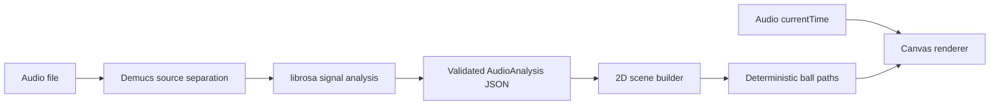
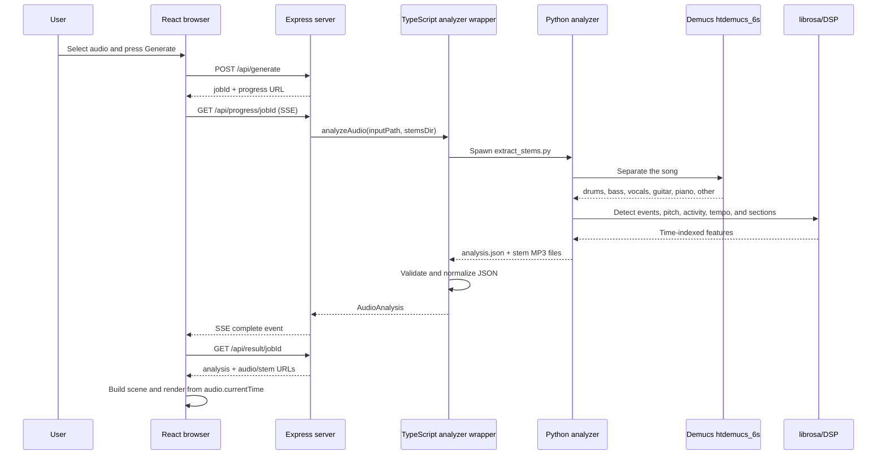
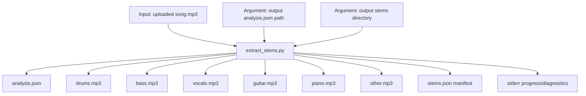
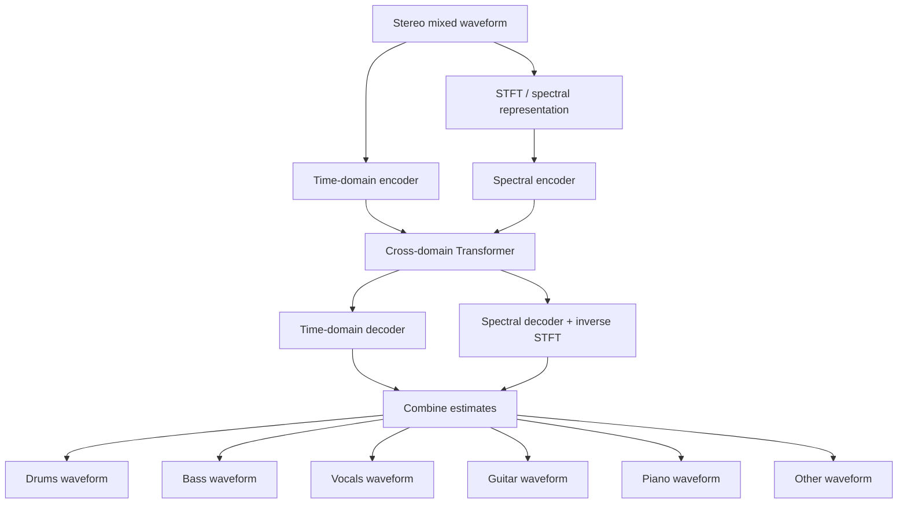
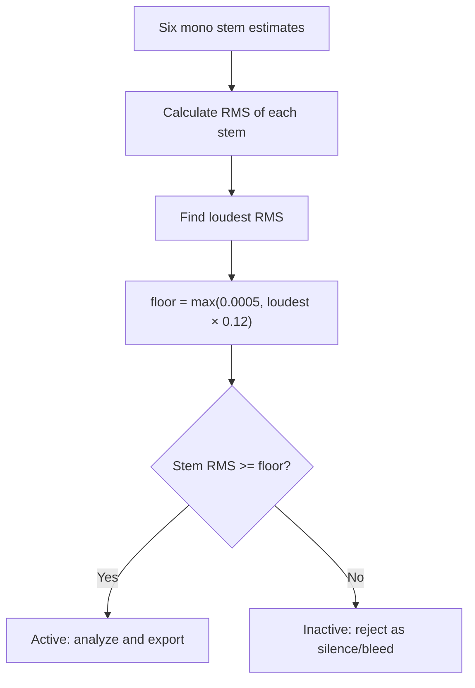
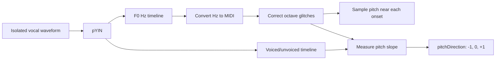
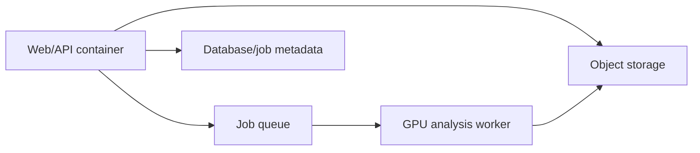

# MotionScore Architecture and Audio-to-Animation Pipeline

This document explains how MotionScore turns an uploaded song into an interactive
2D music visualization. It covers the architecture, every pipeline stage, the
meaning of audio stems, how Demucs and librosa are used, the JSON contracts,
validation, the exact mapping from analysis values to animation, hosting
considerations, and possible future features.

> Examples in this document are illustrative and use the current version-1
> field names and value ranges. Complete examples follow the schema; shortened
> array/track fragments are explicitly labeled as abbreviated.

## 1. The central idea

MotionScore does **not** send raw audio directly to the canvas.

It performs two distinct jobs:

1. Analyze the complete song and convert it into a validated, time-indexed
   musical description.
2. Convert that description into deterministic motion paths and sample those
   paths using the audio player's current playback time.



This separation is important:

- The Python analyzer decides **what is happening musically**.
- The TypeScript scene builder decides **how that musical information should
  move and look**.
- The browser audio element decides **what time is currently being displayed**.

## 2. Repository architecture

MotionScore is a TypeScript npm-workspace monorepo with one Python analysis
subsystem.

| Package | Responsibility |
|---|---|
| `@motionscore/types` | Shared data contracts, role metadata, and runtime validation |
| `@motionscore/note-extractor` | TypeScript-to-Python boundary and analysis-result parsing |
| `@motionscore/web` | Express API, React application, 2D scene builder, and canvas renderer |
| `packages/note-extractor/python` | Demucs separation, librosa DSP, pitch tracking, and stem export |

The main implementation files are:

- [`packages/web/src/server.ts`](packages/web/src/server.ts) — upload, jobs,
  progress, result and audio endpoints
- [`packages/note-extractor/src/audio-events.ts`](packages/note-extractor/src/audio-events.ts)
  — Python subprocess and raw JSON validation
- [`packages/note-extractor/python/extract_stems.py`](packages/note-extractor/python/extract_stems.py)
  — neural separation and per-instrument analysis
- [`packages/note-extractor/python/extract_events.py`](packages/note-extractor/python/extract_events.py)
  — shared librosa/DSP helpers
- [`packages/types/src/data-contracts.ts`](packages/types/src/data-contracts.ts)
  — central `AudioAnalysis` contract
- [`packages/web/src/client/src/App.tsx`](packages/web/src/client/src/App.tsx)
  — client workflow
- [`packages/web/src/client/src/scene2d/model.ts`](packages/web/src/client/src/scene2d/model.ts)
  — audio-analysis-to-motion mapping
- [`packages/web/src/client/src/scene2d/render.ts`](packages/web/src/client/src/scene2d/render.ts)
  — canvas drawing and camera

## 3. What the application looks like

### Before analysis

- MotionScore header
- File upload panel on the left
- Generate button
- Empty visualization area on the right

### During analysis

- The upload controls become busy.
- A progress list displays server and analyzer messages.
- The browser stays connected to a Server-Sent Events endpoint.

### After analysis

- A live canvas visualization
- One colored ball per detected role by default
- Contact lines, ramps, arcs, and catch bowls
- Audio transport controls
- A stem mixer for mute and solo
- Controls for grouping, merging, hiding, repositioning, and tilting balls
- A summary panel for role activity, energy, tempo, and section cues

## 4. Complete end-to-end pipeline



---

# Stage-by-stage explanation

## Stage 1: Upload

The browser sends a multipart request:

```http
POST /api/generate
Content-Type: multipart/form-data

file=<song.mp3>
```

The server:

1. Accepts `.mp3`, `.wav`, `.flac`, or `.ogg`.
2. Rejects files larger than 200 MB.
3. Stores the file in the operating system's temporary directory.
4. Creates a 12-character job ID.
5. Creates an in-memory job object.
6. Returns immediately instead of holding the upload request open throughout
   analysis.

Example response:

```json
{
  "jobId": "V7p4k3MzN2Qa",
  "progressUrl": "/api/progress/V7p4k3MzN2Qa"
}
```

## Stage 2: Live progress

The browser opens an SSE connection:

```http
GET /api/progress/V7p4k3MzN2Qa
Accept: text/event-stream
```

SSE means **Server-Sent Events**. It is a persistent, server-to-browser stream.
It is appropriate here because the server needs to send progress while the
browser only needs to listen.

The progress percentages are named stage milestones, not a precise estimate of
remaining time:

| Percent | Stage | Meaning |
|---:|---|---|
| `5` | Upload complete | The server accepted and stored the file |
| `12` | Hardware check | Python and GPU/CPU selection are being prepared |
| `16` | Environment | The Python analyzer started |
| `20` | Model loading | Demucs is loading `htdemucs_6s` |
| `24` | Audio decoding | The uploaded audio is being decoded |
| `30` | Source separation | Demucs is separating the mix |
| `58` | Stem detection | Weak or empty estimated stems are being rejected |
| `60`–`75` | Instrument analysis | Active stems are analyzed one at a time |
| `78` | Stem export | Playable component MP3s and the manifest are written |
| `84` | Role signals | Compact activity, sustain, and pitch signals are built |
| `90` | Song structure | Full-mix energy and section cues are calculated |
| `96` | Result encoding | The analyzer is serializing its JSON result |
| `100` | Complete | Validation and result preparation succeeded |

Example SSE messages:

```text
data: {"stage":"Upload complete","message":"Uploaded — preparing neural analysis","percent":5}

data: {"stage":"Hardware check","message":"GPU detected — separating instruments (neural)","percent":12}

data: {"stage":"Source separation","message":"Separating the mix into six sources","percent":30}

data: {"status":"complete","stage":"Complete","message":"Analysis complete","percent":100,...}
```

### How to interpret progress correctly

- `30%` does not mean Demucs has processed exactly 30% of the audio.
- The separation stage may consume most of the total wall-clock time.
- pYIN pitch tracking can also be slow after separation.
- A long pause during Source separation or Instrument analysis can be normal.
- Progress should be treated as a **stage indicator**, not a linear timer.

The Python process emits machine-readable `[motionscore] progress {...}` marker
lines on `stderr`. The TypeScript server parses those markers and forwards the
stage, message, and percentage through SSE. Ordinary diagnostic lines remain
visible without being mistaken for structured progress.

## Stage 3: TypeScript-to-Python boundary and the meaning of “stem”

### What is a stem?

In audio production, a **stem** is an isolated component of a mixed recording.
For example:

- vocals without the instruments
- drums without vocals or bass
- bass without drums

It does not necessarily mean one original studio track. When the original
multitrack recording is unavailable, a source-separation model estimates what
each component probably sounded like.

```text
Original mixed song
  = vocals + drums + bass + guitar + piano + other sounds

Source separation estimates:
  vocals.mp3
  drums.mp3
  bass.mp3
  guitar.mp3
  piano.mp3
  other.mp3
```

### What the TypeScript wrapper runs

Conceptually, the Node process launches:

```powershell
.venv\Scripts\python.exe `
  packages\note-extractor\python\extract_stems.py `
  <uploaded-audio-path> `
  <temporary-analysis-json-path> `
  stems `
  <temporary-stems-directory>
```

The actual process uses `spawn(..., { shell: false })`, so arguments are passed
directly without shell interpretation.

### Input and output diagram



Only stems that pass the presence test are exported.

### Python subprocess progress

Python writes progress and diagnostics to `stderr`, for example:

```text
[motionscore] stems: separating on CUDA (model htdemucs_6s, shifts=0)
```

If CUDA fails, it reports the failure and retries on CPU:

```text
[motionscore] stems: CUDA failed (<error>); retrying on CPU
```

The server detects `[motionscore]` lines and forwards them to the SSE stream at
the coarse `45%` milestone.

### Main error categories

| Error | Meaning | Application behavior |
|---|---|---|
| Python executable not found | `.venv` is missing or `PYTHON` is wrong | Returns setup guidance |
| `ModuleNotFoundError` / import failure | torch, Demucs, or librosa is missing | Adds dependency-install guidance |
| Decoder error | File is damaged or its codec cannot be decoded | Python exits non-zero; captured stderr is returned |
| CUDA out-of-memory or CUDA runtime failure | GPU separation failed | Python attempts CPU fallback |
| Analyzer timeout | Process ran for more than 15 minutes | Child process is killed |
| Invalid JSON | Python output was truncated or malformed | JSON parsing fails |
| Invalid version-1 payload | JSON exists but violates the schema | The exact failing field is reported |
| Stem export failure | MP3 export or manifest write failed | Analysis continues; mixer stems may be absent |

Stem export is intentionally best-effort. The visualization can still work from
the analysis JSON even if separated MP3 export fails.

### Raw Python JSON example

The JSON produced directly by Python looks approximately like this. This sample
shortens the 10 Hz arrays and shows only two of eight tracks, so it is an
explanatory fragment rather than a complete validator-ready file:

```json
{
  "version": 1,
  "durationSec": 12.4,
  "tempo": 120.0,
  "mode": "stems",
  "events": [
    {
      "timeSec": 0.5,
      "pitchMidi": 36,
      "velocity": 0.91,
      "role": "kick",
      "confidence": 0.9,
      "salience": 0.88
    },
    {
      "timeSec": 1.0,
      "pitchMidi": 64,
      "velocity": 0.72,
      "role": "guitar",
      "confidence": 0.82,
      "salience": 0.63
    }
  ],
  "featureFrames": [
    {
      "timeSec": 0.0,
      "loudness": 0.12,
      "bassEnergy": 0.18,
      "brightness": 0.34,
      "onsetDensity": 0.05,
      "harmonicEnergy": 0.2,
      "percussiveEnergy": 0.1
    }
  ],
  "sectionCues": [
    {
      "type": "build",
      "startSec": 7.0,
      "endSec": 9.5,
      "peakSec": 9.5,
      "intensity": 0.78,
      "confidence": 0.86
    },
    {
      "type": "drop",
      "startSec": 9.5,
      "endSec": 10.0,
      "peakSec": 9.5,
      "intensity": 0.9,
      "confidence": 0.91
    }
  ],
  "roleSignals": {
    "version": 1,
    "frameRateHz": 10,
    "frameCount": 125,
    "tracks": [
      {
        "role": "kick",
        "activityQ8": [0, 12, 240, 98, 0],
        "sustainSpans": []
      },
      {
        "role": "guitar",
        "activityQ8": [0, 45, 181, 205, 176],
        "sustainSpans": [[2, 5]],
        "pitchDirection": [0, 0, 1, 1, 0],
        "pitchCoverageQ8": 221
      }
    ]
  }
}
```

The real `activityQ8` and `pitchDirection` arrays contain exactly one value per
10 Hz frame, and the real `tracks` array contains all eight roles in canonical
order.

## Stage 4: Demucs and `htdemucs_6s`

### Is Demucs a library?

Yes. Demucs is a Python package containing:

- pretrained source-separation models
- model-loading code
- inference code
- command-line tools
- training code

MotionScore installs `demucs==4.0.1` and loads a pretrained model through:

```python
from demucs.pretrained import get_model

model = get_model("htdemucs_6s")
```

`htdemucs_6s` is not another Python script. It is a **pretrained neural-network
model** used by the Demucs Python library. The model weights download
automatically on first use. MotionScore is performing inference, not training
the model.

### What does the name mean?

- `HT` — Hybrid Transformer
- `Demucs` — the model family
- `6s` — six-source version

The six requested sources are:

```text
drums, bass, vocals, guitar, piano, other
```

The official Demucs project describes `htdemucs_6s` as an experimental
six-source model that adds guitar and piano to the standard four-source model.
It also warns that piano separation is less reliable and can contain bleeding
or artifacts.

### How HT Demucs works conceptually

A mixed waveform contains overlapping sounds:

```text
mix(t) ≈ drums(t) + bass(t) + vocals(t)
       + guitar(t) + piano(t) + other(t)
```

The model has learned statistical patterns that distinguish these sources. It
does not look for a perfect “vocal frequency band,” because vocals and
instruments overlap in frequency. Instead, it uses learned temporal, spectral,
and long-context patterns.

HT Demucs processes two representations in parallel:

1. **Waveform/time branch** — learns shapes and timing directly from audio
   samples.
2. **Spectrogram/frequency branch** — sees how energy is distributed across
   frequency and time.

A cross-domain Transformer allows the two representations to exchange
information using self-attention and cross-attention. Decoder branches then
reconstruct one waveform estimate per source.



This is an inference-level conceptual diagram, not a layer-by-layer reproduction
of the complete network.

### What MotionScore gives the model

1. librosa decodes the input.
2. Audio is resampled to the model's sampling rate.
3. Mono input is duplicated to stereo.
4. The waveform is converted to a PyTorch tensor.
5. The waveform is standardized using its mean and standard deviation.
6. The tensor is processed on CUDA when available.

Simplified tensor shapes:

```text
Input:
  [channels=2, samples]

Model input batch:
  [batch=1, channels=2, samples]

Estimated output:
  [batch=1, sources=6, channels=2, samples]
```

MotionScore later converts each estimated stereo source to mono for analysis and
stem export.

### Can the six components be created and played individually?

Yes. This is exactly what source separation provides.

Using the Demucs command-line tool directly:

```powershell
.\.venv\Scripts\python.exe -m demucs `
  -n htdemucs_6s `
  --mp3 `
  "C:\Music\example-song.mp3"
```

Expected output directory:

```text
separated/
└── htdemucs_6s/
    └── example-song/
        ├── drums.mp3
        ├── bass.mp3
        ├── vocals.mp3
        ├── guitar.mp3
        ├── piano.mp3
        └── other.mp3
```

MotionScore does not use the CLI for its main pipeline; it calls the Demucs
Python API and exports its own mono MP3 files. But the underlying idea is the
same.

### Important limitations

- The outputs are estimates, not the original studio multitracks.
- Sound can leak between stems.
- Transients can be softened or distorted.
- Reverb often appears in more than one stem.
- “Other” can contain several instruments.
- The official Demucs project specifically cautions that the six-source piano
  output is not as reliable as the core sources.
- Adding the separated outputs together may approximate the mix, but may not
  reproduce it perfectly because of estimation artifacts, clipping, or export
  processing.

## Stage 5: Detect which stems are truly present

Demucs always returns an estimate for each configured source, even if the song
does not actually contain that instrument. A nominal piano output, for example,
may only contain faint leakage from vocals or guitar.

MotionScore therefore performs a presence test before treating a stem as active.

### Input

One mono waveform per Demucs source:

```text
drums waveform
bass waveform
vocals waveform
guitar waveform
piano waveform
other waveform
```

### Operation

For each waveform, calculate RMS:

```text
RMS = sqrt(mean(sample²))
```

Then find the loudest stem and calculate:

```text
presence_floor = max(
    0.0005,
    0.12 × loudest_stem_RMS
)
```

Any stem below that floor is ignored.



### Example

Suppose the estimated RMS values are:

| Stem | RMS |
|---|---:|
| drums | `0.100` |
| bass | `0.055` |
| vocals | `0.032` |
| guitar | `0.019` |
| piano | `0.008` |
| other | `0.024` |

The loudest stem is drums at `0.100`:

```text
relative threshold = 0.12 × 0.100 = 0.012
absolute threshold = 0.0005
presence floor      = max(0.012, 0.0005) = 0.012
```

Result:

```text
drums   0.100  → keep
bass    0.055  → keep
vocals  0.032  → keep
guitar  0.019  → keep
piano   0.008  → reject
other   0.024  → keep
```

### Output

- `active`: names of accepted stems
- `analysis_stems`: resampled mono signals used by subsequent analysis
- exported MP3 files for active stems
- no role actor based solely on a tiny rejected stem

This is not a classifier that proves an instrument exists. It is an
energy-relative safeguard against obvious low-level separation leakage.

## Stage 6: Onset and event extraction

An **onset** is the beginning of a musically meaningful sound:

- a kick impact
- a snare strike
- a picked guitar note
- the beginning of a sung syllable
- a piano key attack

For each active stem, MotionScore:

1. Computes an STFT magnitude spectrogram.
2. Converts magnitude to decibels.
3. Computes an onset-strength envelope.
4. Robustly normalizes the envelope.
5. Peak-picks candidate attacks.
6. Rejects events less than `0.09` seconds apart for the same detector.
7. For pitched roles, rejects an onset when its stem-local activity is below
   `0.18`.
8. Converts the remaining peaks into event dictionaries.

Example:

```text
Time                  0.0   0.2   0.4   0.6   0.8   1.0
Guitar onset strength 0.02  0.10  0.93  0.18  0.12  0.78
Detected onset                    ▲                 ▲
```

For the separated drums stem, frequency bands are used:

| Analysis role | Frequency range |
|---|---:|
| kick | 20–140 Hz |
| snare | 140–2,500 Hz |
| percussion | 2,500 Hz to Nyquist |

These three roles are analysis subdivisions of one playable drums stem.

## Stage 7: Pitch tracking with pYIN

Onsets tell the application **when** something happens. Pitch tracking tells it
**how high or low** pitched material is and whether it is moving upward or
downward.

### Input

A separated, active mono waveform for a pitched role:

```text
bass, vocal, piano, guitar, or melodic/other
```

Each role has an expected F0 range:

| Role | Search range |
|---|---:|
| bass | 41–400 Hz |
| vocal | 80–1,100 Hz |
| guitar | 80–1,320 Hz |
| piano | 55–2,100 Hz |
| melodic | 65–2,100 Hz |

Constraining the range improves speed and rejects implausible octave or bleed
estimates.

### Operation

`librosa.pyin` estimates:

- `f0`: fundamental frequency in Hertz for every pitch frame
- `voiced`: whether a stable pitched sound is present
- voiced probability

MotionScore converts Hertz to MIDI:

```text
MIDI = 69 + 12 × log2(frequency / 440)
```

Examples:

| Frequency | Approximate note | MIDI |
|---:|---|---:|
| 110 Hz | A2 | 45 |
| 220 Hz | A3 | 57 |
| 440 Hz | A4 | 69 |
| 880 Hz | A5 | 81 |

It clamps usable MIDI estimates to 21–108.



### Attack-frame handling

The exact attack frame can be noisy or unvoiced. For each onset, MotionScore
searches the pYIN timeline in this order:

```text
current frame → next frame → previous frame → two frames forward
```

That favors the stable sustain immediately following the attack.

If pYIN has no usable estimate near an onset, the analyzer falls back to a
coarse spectral-centroid-derived pitch. This prevents a missing pitch from
breaking event creation.

### Octave stabilization

Pitch trackers occasionally produce a one-octave mistake:

```text
60, 61, 72, 62, 63
        ^^ likely octave glitch
```

MotionScore uses a local window of approximately `0.9` seconds to fold suspicious
octave jumps toward the local median. This prevents the ball from suddenly
moving an octave because of a tracking error.

### Pitch-direction output

Pitch slope is measured in semitones per second.

- Enter rising state at `>= +1.0` semitone/second.
- Enter falling state at `<= -1.0` semitone/second.
- Exit rising when below `+0.4`.
- Exit falling when above `-0.4`.

The separate enter and exit thresholds form a Schmitt trigger. It prevents
direction from flickering rapidly around zero.

Example:

```json
{
  "role": "vocal",
  "activityQ8": [30, 110, 190, 220, 205, 180],
  "sustainSpans": [[1, 6]],
  "pitchDirection": [0, 0, 1, 1, 0, -1],
  "pitchCoverageQ8": 230
}
```

Interpretation:

- Frames 1–5 contain sustained vocal activity.
- The melody becomes clearly rising at frames 2–3.
- It levels off at frame 4.
- It begins falling at frame 5.
- `230 / 255 ≈ 90%` of active frames had a usable pitch estimate.

## Stage 8: Continuous role signals

Discrete events alone cannot describe a held vocal note, a guitar chord, or a
long bass tone. MotionScore therefore builds one continuous activity timeline
per role.

### Input

- Magnitude spectrogram for an isolated role
- pYIN pitch track for pitched roles
- Song duration

### Activity calculation

1. Calculate energy per analysis frame.
2. Apply fast-attack/slow-release smoothing:
   - attack time: `0.05` seconds
   - release time: `0.25` seconds
3. Convert energy to decibels.
4. Normalize relative to that role's own 95th- and 20th-percentile levels.
5. Resample to exactly 10 frames per second.
6. Quantize `[0,1]` activity to integer `[0,255]`.

Example:

```text
Normalized activity: 0.00  0.18  0.52  0.81  0.65  0.15
Q8 output:             0    46   133   207   166    38
```

To convert Q8 back:

```text
normalized activity = activityQ8 / 255
```

### Sustain spans

A sustain begins when activity reaches `0.30` and ends only after two
consecutive frames at or below `0.18`.

This hysteresis bridges one-frame dips:

```text
Frame:      0    1    2    3    4    5    6
Activity:  .05  .32  .55  .16  .48  .15  .12
State:      -   ON   ON   ON   ON   low  OFF
Span:           [1 ------------------- 5)
```

The corresponding JSON uses an inclusive start and exclusive end:

```json
{
  "sustainSpans": [[1, 5]]
}
```

At 10 Hz, frame 1 begins at `0.1` seconds and frame 5 begins at `0.5` seconds.

### Output

One abbreviated role-signal track fragment looks like:

```json
{
  "role": "bass",
  "activityQ8": [0, 31, 144, 211, 178],
  "sustainSpans": [[2, 5]],
  "pitchDirection": [0, 0, 1, 0, -1],
  "pitchCoverageQ8": 198
}
```

In the complete `roleSignals` object, `frameRateHz` is 10, the `tracks` array
contains all eight roles in canonical order, and each per-frame array has
exactly `frameCount` entries. For a 124-second song, approximately 1,241 frames
are expected because the timeline includes time zero and advances in
0.1-second increments.

## Stage 9: Full-mix librosa analysis

### What is librosa?

librosa is a Python library for music and audio analysis. Demucs answers:

> “Which estimated source does this sound belong to?”

librosa answers questions such as:

> “When did an attack happen?”  
> “How loud, bright, bass-heavy, harmonic, or percussive is this moment?”  
> “What is the likely pitch?”  
> “What is the approximate tempo?”  
> “Is the track building, falling, breaking down, or dropping?”

### What librosa does in this project

| librosa operation | Purpose in MotionScore |
|---|---|
| `load` | Decode the uploaded file |
| `resample` | Convert signals to the analysis/model sample rate |
| `to_mono` | Combine stereo channels for analysis |
| `stft` | Convert short waveform windows into frequency-time data |
| `decompose.hpss` | Separate harmonic-like and percussive-like spectrogram content |
| `onset_strength` | Measure how strongly a new sound begins over time |
| `onset_strength_multi` | Measure onsets within low/mid/high frequency bands |
| `spectral_centroid` | Estimate spectral brightness |
| `feature.rms` | Measure signal energy |
| `pyin` | Estimate fundamental pitch and voicing |
| `beat_track` | Estimate global tempo |
| `frames_to_time` / `times_like` | Align feature frames with seconds |

### STFT example

A waveform is one amplitude value after another:

```text
time samples: 0.01, 0.08, 0.22, -0.15, ...
```

The STFT takes overlapping short windows and produces a complex-valued
time-frequency matrix:

```text
                 Time →
Frequency  8 kHz  ░░▒▒▓░
    ↑      2 kHz  ░▒▓▓▒░
           200 Hz ▒▓▓▒░░
            50 Hz ▓▒░░▒▓
```

MotionScore uses:

```text
n_fft = 2048
hop_length = 512
analysis sample rate = 22,050 Hz
```

Each STFT column summarizes a short window. Adjacent columns begin 512 samples
apart.

### Full-mix feature output

Every 0.1 seconds, the analyzer emits normalized values:

```json
{
  "timeSec": 42.3,
  "loudness": 0.87,
  "bassEnergy": 0.93,
  "brightness": 0.61,
  "onsetDensity": 0.78,
  "harmonicEnergy": 0.55,
  "percussiveEnergy": 0.91
}
```

Interpretation:

- loud overall moment
- very strong low-frequency energy
- moderately bright
- many attacks
- mixed harmonic content
- strongly percussive

These values are normalized relative to the song. A value of `0.9` means high
for this track, not an absolute calibrated acoustic measurement.

### Section-cue example

The analyzer computes a weighted energy curve:

```text
energy =
  0.42 × loudness
  + 0.33 × bassEnergy
  + 0.15 × onsetDensity
  + 0.10 × percussiveEnergy
```

It compares sustained changes against the track's own 25th-to-80th-percentile
dynamic range.

```text
quiet dip        build/rise               drop
____             / / / / /                │████████
    \___________/                         │████████
```

Example cue:

```json
{
  "type": "drop",
  "startSec": 63.2,
  "endSec": 63.7,
  "peakSec": 63.2,
  "intensity": 0.92,
  "confidence": 0.88
}
```

This means the detector found a strong transition from a genuine low-energy dip
to a sustained high-energy section, with bass evidence.

## Stage 10: Playable stem export

Yes, the stems can be played individually.

MotionScore exports each active whole Demucs stem as a mono MP3 and writes a
manifest:

```json
[
  {"name": "drums", "file": "drums.mp3"},
  {"name": "bass", "file": "bass.mp3"},
  {"name": "vocals", "file": "vocals.mp3"},
  {"name": "guitar", "file": "guitar.mp3"}
]
```

The server safely reconstructs each path from the sanitized stem name instead
of trusting the manifest's file path. It exposes URLs like:

```text
/api/stem/V7p4k3MzN2Qa/drums
/api/stem/V7p4k3MzN2Qa/bass
/api/stem/V7p4k3MzN2Qa/vocals
```

The browser creates one hidden `<audio>` element per stem. The main mix audio
element remains the master transport and clock. The source selector can play
either the original mix or the separated components. The component player
provides:

- one-click Listen/Pause for an individual stem
- Mute and Solo for each stem
- an independent volume slider
- MP3 download
- detected-hit count and pitch-coverage diagnostics

The player mirrors:

- play
- pause
- seek
- playback rate

Every 250 ms it checks synchronization. A stem more than 0.12 seconds away from
the master is realigned.

Important limitation:

```text
Playable: drums, bass, vocals, guitar, piano, other
Analysis only: kick, snare, percussion
```

Kick, snare, and percussion are frequency-band interpretations of the one drums
stem, not three independently separated waveforms.

## Stage 11: Validation

Validation protects the renderer from malformed, incomplete, impossible, or
version-incompatible analyzer output.

There are two related validation layers.

### Layer A: Raw Python payload validation

Before constructing `AudioAnalysis`, TypeScript checks:

- root is a JSON object
- `version === 1`
- duration and tempo are finite and non-negative
- `mode === "stems"`
- event, frame, cue, and track containers are arrays
- event times are within the song duration
- event pitch is within 0–127
- normalized values are within 0–1
- cue types are from the supported set
- role-signal frame rate is exactly 10 Hz
- role-signal frame count matches feature-frame count
- exactly eight role tracks exist in canonical order
- `activityQ8` length equals frame count
- every activity value is an integer from 0–255
- sustain spans are valid, ordered, non-overlapping, and within the frame count
- pitch direction exists only for pitched roles
- pitch-direction values are exactly `-1`, `0`, or `1`
- pitch coverage is an integer from 0–255

### Valid raw example

```json
{
  "version": 1,
  "durationSec": 10,
  "tempo": 120,
  "mode": "stems",
  "events": [
    {
      "timeSec": 1.25,
      "pitchMidi": 69,
      "velocity": 0.8,
      "role": "vocal",
      "confidence": 0.9,
      "salience": 0.75
    }
  ],
  "featureFrames": [],
  "sectionCues": []
}
```

### Invalid example: impossible normalized value

```json
{
  "events": [
    {
      "timeSec": 1.25,
      "pitchMidi": 69,
      "velocity": 1.7
    }
  ]
}
```

Result:

```text
Audio analyzer returned an invalid version-1 payload
at events[0].velocity: 1.7
```

### Invalid example: mismatched timelines

```json
{
  "featureFrames": ["100 frames"],
  "roleSignals": {
    "frameCount": 99
  }
}
```

Result:

```text
Invalid payload at roleSignals.frameCount
```

This matters because the renderer expects role activity frame `n` to correspond
to full-mix feature frame `n`.

### Invalid example: overlapping sustain spans

```json
{
  "sustainSpans": [[10, 30], [25, 40]]
}
```

The second span begins before the previous span has ended, so validation rejects
it.

### Layer B: `NoteEvent` validation

The shared validator can also enforce:

- non-empty, unique IDs
- integer MIDI pitch from 0–127
- finite `startSec >= 0`
- `endSec > startSec`
- velocity, confidence, and salience in 0–1
- known role
- `source === "audio"`

Example:

```json
[
  {
    "id": "n0001",
    "pitchMidi": 64,
    "startSec": 2.4,
    "endSec": 2.52,
    "velocity": 0.7,
    "source": "audio",
    "role": "guitar"
  },
  {
    "id": "n0001",
    "pitchMidi": 67,
    "startSec": 3.0,
    "endSec": 3.12,
    "velocity": 0.8,
    "source": "audio",
    "role": "guitar"
  }
]
```

The duplicate ID produces a structured `ValidationError` identifying:

```text
stage = "Analysis (NoteEvent)"
field = "events[1].id"
value = "n0001"
```

### What validation can and cannot prove

Validation can prove:

- the data is structurally safe and internally consistent
- fields have valid types and ranges
- aligned arrays have compatible lengths

Validation cannot prove:

- the separated vocal is perfectly clean
- every detected onset is musically correct
- a guitar was not misclassified as “other”
- a pitch estimate is perceptually correct
- a section cue matches a human producer's interpretation

Those are model-quality questions and require listening tests, annotated test
data, or confidence/quality metrics.

## Stage 12: Final server result

After validation, the raw Python event:

```json
{
  "timeSec": 1.25,
  "pitchMidi": 69,
  "velocity": 0.8,
  "role": "vocal",
  "confidence": 0.9,
  "salience": 0.75
}
```

becomes a `NoteEvent`:

```json
{
  "id": "n0001",
  "pitchMidi": 69,
  "startSec": 1.25,
  "endSec": 1.37,
  "velocity": 0.8,
  "source": "audio",
  "role": "vocal",
  "track": "vocal",
  "instrument": "vocal",
  "confidence": 0.9,
  "salience": 0.75
}
```

Event duration is currently represented as a fixed 0.12-second interval. Longer
continuous behavior comes from role signals and sustain spans, not `endSec`.

The browser's `/api/result/{jobId}` response looks like the following. Arrays
and tracks are shortened here for readability, so this is not a literal complete
response:

```json
{
  "durationSec": 124.08,
  "audioUrl": "/api/audio/V7p4k3MzN2Qa",
  "analysis": {
    "version": 1,
    "durationSec": 124.08,
    "tempoBpm": 120,
    "mode": "stems",
    "hits": [
      {
        "id": "n0001",
        "pitchMidi": 36,
        "startSec": 0.5,
        "endSec": 0.62,
        "velocity": 0.91,
        "source": "audio",
        "role": "kick",
        "confidence": 0.9,
        "salience": 0.88
      }
    ],
    "featureFrames": [],
    "sectionCues": [],
    "roleSignals": {
      "version": 1,
      "frameRateHz": 10,
      "frameCount": 1241,
      "tracks": []
    }
  },
  "stems": [
    {
      "id": "drums",
      "label": "Drums",
      "url": "/api/stem/V7p4k3MzN2Qa/drums"
    },
    {
      "id": "vocals",
      "label": "Vocals",
      "url": "/api/stem/V7p4k3MzN2Qa/vocals"
    }
  ]
}
```

The arrays are abbreviated above. A real result contains every feature frame,
all eight role-signal tracks, and all detected events.

## Stage 13: Convert analysis into a 2D scene

`buildScene2D()` converts `AudioAnalysis` into actors, contacts, support rails,
and motion segments.

### Default roles and colors

| Role | Default color | Physics family |
|---|---|---|
| kick | red | rhythm |
| snare | yellow | rhythm |
| percussion | green/teal | rhythm |
| bass | orange | bass |
| melodic | blue | lead |
| piano | purple | lead |
| guitar | pink | lead |
| vocal | light green | lead |

Users can regroup roles. By default, each detected role gets its own ball.

### Main construction steps

1. Filter roles according to visibility settings.
2. Convert every onset into a contact.
3. Merge events at exactly the same time into one contact.
4. Derive sustained-support spans from role activity.
5. Reject sustain spans that have no nearby real onset.
6. Bridge short articulation gaps.
7. Detect long silences.
8. Place roles into automatic vertical lanes ordered by pitch register.
9. Place anchors at contacts and sustain boundaries.
10. Apply pitch, section-cue, activity, and convergence offsets.
11. Create ballistic or cubic-slide segments between anchors.
12. Derive physical line geometry from incoming and outgoing velocity.

## Stage 14: Exact analysis-to-animation mappings

Canvas Y increases downward:

```text
smaller Y = visually higher
larger Y  = visually lower
```

This convention is essential when interpreting the formulas below.

### A. Time controls horizontal location

```text
x = timeSec × 6 + actorBias
```

Examples:

| Event time | Base X position |
|---:|---:|
| 1 second | 6 world units |
| 5 seconds | 30 world units |
| 30 seconds | 180 world units |

The camera follows the active actors, so the viewer sees motion through the
track rather than the entire song stretched across one screen.

### B. An onset creates a physical contact

```json
{
  "startSec": 12.4,
  "role": "kick",
  "salience": 0.9
}
```

At exactly 12.4 seconds:

- the kick ball reaches its contact point
- the contact line becomes visible
- the ball receives a 0.12-second squash effect
- the line style is chosen from the motion around that contact

Possible line styles:

| Style | Typical cause |
|---|---|
| `kicker` | ordinary isolated impact |
| `step` | rapid consecutive contacts |
| `ramp` | contact touches a sustained slide |
| `catch` | steep descent or off-screen re-entry |

No returned event is intentionally dropped by the renderer.

### C. Absolute pitch controls vertical register

For non-rhythm actors:

```text
pitch offset Y = -(pitchMidi - actorMedianPitch) × 0.1
```

Suppose a vocal actor's median pitch is MIDI 60:

| Event pitch | Calculation | Visual result |
|---:|---:|---|
| 48 | `-(48-60)×0.1 = +1.2` | 1.2 units lower |
| 60 | `0` | center of its pitch lane |
| 67 | `-(67-60)×0.1 = -0.7` | 0.7 units higher |
| 72 | `-(72-60)×0.1 = -1.2` | 1.2 units higher |

Therefore a high note goes up and a low note goes down.

Pitch is relative to that actor's median, not one global MIDI-to-screen
coordinate. A bass and soprano can therefore both remain visible in readable
lanes.

### D. Pitch direction bends a sustained rail

During supported, sustained material:

```text
pitchDirection = +1  → Y decreases → rail rises
pitchDirection =  0  → no pitch-direction displacement
pitchDirection = -1  → Y increases → rail falls
```

The continuous contribution is approximately:

```text
ΔY from direction = -pitchDirection × 0.58 × elapsedSeconds
```

Example over one second:

| Direction | Approximate contribution | Visual result |
|---:|---:|---|
| `+1` | `-0.58` | upward rail |
| `0` | `0` | level relative to other forces |
| `-1` | `+0.58` | downward rail |

### E. Sustained activity creates an upward swell

For pitched actors, activity above `0.35` adds:

```text
activity lift Y = -4.5 × (activity - 0.35)
```

Examples:

| Normalized activity | Q8 equivalent | Y lift | Visual meaning |
|---:|---:|---:|---|
| `0.20` | `51` | `0` | too low to trigger swell |
| `0.35` | `89` | `0` | threshold |
| `0.50` | `128` | `-0.675` | moderate upward swell |
| `0.80` | `204` | `-2.025` | strong upward surge |
| `1.00` | `255` | `-2.925` | maximum activity surge |

A singer leaning into a long loud note can therefore lift the vocal ball even
when the pitch itself stays steady.

### F. Section cues create macro movement

The effective amount is:

```text
amount = intensity × confidence
```

Because positive Y is down:

| Cue | Mapping | Visual result |
|---|---|---|
| `build` | up to `-1.8 × amount × progress` | progressively rises |
| `rise` | up to `-1.8 × amount × progress` | progressively rises |
| `fall` | up to `+1.5 × amount × progress` | progressively descends |
| `breakdown` | up to `+0.8 × amount × progress` | gentler descent |
| `drop` | peak of `+2.6 × amount` near `peakSec` | pronounced downward impact |

Example build:

```json
{
  "type": "build",
  "startSec": 40,
  "endSec": 48,
  "intensity": 0.8,
  "confidence": 0.9
}
```

```text
amount = 0.8 × 0.9 = 0.72
maximum build offset = -1.8 × 0.72 = -1.296
```

The path gradually rises by up to approximately 1.3 world units.

Example drop:

```json
{
  "type": "drop",
  "startSec": 48,
  "endSec": 48.5,
  "peakSec": 48,
  "intensity": 0.95,
  "confidence": 0.9
}
```

```text
amount = 0.855
peak drop offset = +2.6 × 0.855 ≈ +2.22
```

At the peak, this contributes a sudden downward displacement of approximately
2.22 world units.

### G. Rapid notes become steps

The rapid threshold is:

```text
rapidThreshold = beatDuration × 0.55
beatDuration = 60 / tempoBpm
```

At 120 BPM:

```text
beat duration = 0.5 seconds
rapid threshold = 0.275 seconds
```

Consecutive contacts no more than 0.275 seconds apart are marked rapid.
MotionScore applies a short descending staircase, capped after four steps, and
uses `step` contact geometry.

### H. Rhythm roles have small separate biases

The drum-analysis roles receive small baseline offsets:

```text
kick       → slightly downward
snare      → slightly upward
percussion → slightly downward
```

The offsets are intentionally limited to around a ball radius so the rhythm
track reads as a clean bounce rather than a jagged zigzag.

### I. Salience/velocity affects contact strength

```text
contact strength = salience when present, otherwise velocity
```

Higher strength:

- produces a longer contact line
- can produce a longer support under strong kick/bass impacts
- helps an event win when several near-simultaneous events compete
- contributes to convergence scoring

For example, a strong `0.95` kick produces more substantial contact geometry
than a `0.30` kick, although timing remains the primary motion constraint.

### J. Simultaneous instruments converge

Events from different actors are considered synchronized when they occur within:

```text
min(0.085 seconds, 0.22 × beatDuration)
```

The strongest shared moment in each approximately eight-beat phrase is selected.
A detected drop increases the convergence score.

This can make kick, bass, and vocal balls approach a shared vertical region
around a coordinated musical impact without placing them directly on top of one
another.

### K. Long silence sends an actor off-screen

For pitched actors, a gap longer than approximately:

```text
max(6 seconds, 10 beats)
```

is treated as true dormancy.

The ball:

1. exits the visible scene
2. remains outside the camera framing
3. returns about 0.9 seconds before the next onset
4. lands in a catch bowl

The next note determines the side:

```text
next pitch >= actor median → enter from top
next pitch < actor median  → enter from bottom
```

### L. Playback time selects the current position

The scene is solved into ballistic and cubic-slide segments ahead of playback.
On each animation frame:

```ts
const timeSec = audio.currentTime;
const position = sampleActor(actor, timeSec);
```

Consequences:

- pause audio → animation pauses
- seek audio → animation jumps to the correct location
- change playback speed → animation stays synchronized
- replay → identical motion

It is more accurate to call this **deterministic motion planning and sampling**
than a continuously evolving physics simulation.

## Stage 15: Canvas rendering

The renderer draws:

1. paper-colored background
2. sustained rails and visible track sections
3. contact lines and catch bowls
4. colored balls with dark outlines
5. impact compression at onset time

The camera:

- looks slightly behind and about 2.8 seconds ahead
- follows active actors
- ignores dormant off-screen actors
- uses trimmed bounds so one brief extreme jump does not shrink the entire
  scene

## Stage 16: Cleanup and persistence

The server currently keeps jobs in memory.

Approximately 30 minutes after completion or failure, it removes:

- the uploaded file
- exported stems
- the in-memory job

There is currently no:

- database
- permanent user account
- persistent analysis history
- shared job queue
- recovery after a server restart
- cross-server job coordination

This is appropriate for local experimentation but must be reconsidered for
public hosting.

---

# Windows desktop application

The desktop edition reuses the same client, server, and Python analyzer instead
of duplicating the product in another UI framework:

```text
MotionScore.exe (Electron main process)
    ├── starts bundled Express server on 127.0.0.1:<available-port>
    ├── opens one sandboxed BrowserWindow
    │     └── canvas + Source Lab tab + Scene Controls tab
    └── spawns the external Python analyzer for each job
```

`desktop/build-server.mjs` bundles the server and its JavaScript dependencies
into one ESM file with esbuild. Electron Builder packages that server, the Vite
client, and the external Python analysis scripts into:

- `desktop-dist/win-unpacked/MotionScore.exe`
- `desktop-dist/MotionScore Setup 0.1.0.exe`

The application uses an ephemeral localhost port, disables Node integration in
the page, enables context isolation and the Chromium sandbox, blocks navigation
away from the local app, and opens approved HTTPS links in the system browser.

The approximately 4.7 GB CUDA-enabled Python environment is not copied into the
95 MB installer. Development builds locate the repository `.venv`; installers
built on this computer remember that existing runtime path. A distributable
release for unrelated computers still needs a first-run CPU/GPU runtime
downloader, and a public release should be Authenticode-signed.

---

# Can MotionScore be hosted as a website?

## Short answer

Yes, it can be hosted, but reliable public use is not just a static-site
deployment.

The React interface is inexpensive to host. The expensive component is:

```text
uploaded audio
  → multi-gigabyte Python/PyTorch environment
  → Demucs neural inference
  → temporary stem files
```

A production host needs:

- Node.js
- Python 3.10+
- PyTorch and torchaudio
- Demucs and librosa
- ffmpeg
- enough RAM and temporary disk
- preferably an NVIDIA GPU
- long-running request/job support

## Can it be free for users?

Yes. End users do not have to pay directly. But the computation still has a
cost that must be paid by one of:

- the site owner
- a grant
- a sponsor
- donated/self-hosted hardware
- a strict free/shared compute allowance

## Realistic deployment options

### Option A: Self-host on this computer

Cost beyond electricity and internet: effectively zero.

```text
Public HTTPS/reverse proxy
        ↓
This Express server
        ↓
Local RTX 3070
```

Advantages:

- uses the already-working CUDA environment
- no GPU cloud bill
- full control

Risks:

- the computer must stay on
- home upload bandwidth may be limited
- exposing a local service requires careful HTTPS, firewall, update, and access
  configuration
- untrusted audio uploads create security and resource-exhaustion risk

### Option B: Docker deployment on a GPU host

Package Node, Python, ffmpeg, dependencies, and the production build into one
Docker image.

Recommended additional architecture:



This is the most scalable design but usually is not free.

### Option C: Hugging Face Spaces

Hugging Face supports static, Gradio, and Docker Spaces. A Docker Space could
run the existing Express application after containerization.

As documented by Hugging Face at the time this guide was written:

- CPU Basic is listed at no hourly hardware cost with 2 vCPU, 16 GB RAM, and
  50 GB non-persistent disk.
- Current account policy may still require a paid plan to create a Gradio or
  Docker compute Space.
- Free personal accounts in good standing can host a limited number of Gradio
  ZeroGPU Spaces.
- Dedicated GPU hardware is billed.
- Community GPU grants can be requested.

CPU-only Demucs would probably be too slow for a pleasant multi-user experience,
and a 15-minute application timeout may reject longer jobs.

Therefore, a fully free public deployment is possible only with important
constraints or a grant. A GPU-backed paid deployment is the more reliable
option.

## Changes needed before public hosting

1. Add Docker support and install ffmpeg in the image.
2. Download/cache model weights during image build or warm-up.
3. Replace the in-memory job map with a durable job store.
4. Add a job queue and concurrency limits.
5. Separate the web/API service from GPU workers.
6. Store uploads/results in temporary object storage.
7. Add cancellation.
8. Add rate limiting and per-user quotas.
9. Validate actual file contents, not only filename extensions.
10. Run decoding and analysis with restricted OS permissions.
11. Add malware/abuse protection for uploads.
12. Publish privacy and automatic-deletion policies.
13. Decide whether users may download stems.
14. Address copyright: users should upload audio they are authorized to process.
15. Add observability for queue time, GPU memory, failures, and job duration.

---

# Recommended future features

## Implemented from these recommendations

- Named granular progress stages from upload through result encoding
- One-click individual stem playback
- Original mix versus separated-components A/B switch
- Per-stem mute, solo, and volume controls
- Per-stem MP3 downloads
- Per-stem detected-hit and pitch-coverage summaries

The recommendations below remain useful follow-up work.

## Priority 1: Reliability and transparency

### Better progress reporting

The named stage progression is now implemented. Remaining progress improvements
include segment-level separation progress, elapsed time, and a remaining-time
range:

```text
source separation: segment 3/18, elapsed 00:42, estimated 02:30–03:10 left
instrument analysis: vocal, elapsed 00:18
instrument analysis: guitar, elapsed 00:31
stage timing: separation 03:12, stem detection 00:02, analysis 01:47
```

### Cancel and retry

- Cancel an active analysis
- Retry on CPU after GPU failure
- Retry only stem export
- Preserve the uploaded file briefly for retry

### Analysis-quality diagnostics

Display:

- stem RMS and presence threshold
- active/rejected stems
- pitch coverage by role
- number of onsets by role
- CPU/GPU device used
- elapsed time per stage
- warnings about likely bleed or low-confidence pitch

## Priority 2: Better audio controls

- Pan controls
- Waveform view
- Loop a selected time range
- Playback-speed control
- Stem alignment diagnostic
- Optional high-quality WAV stem export

## Priority 3: Better analysis

- Let users choose four-source versus six-source Demucs
- Compare `htdemucs`, `htdemucs_ft`, and `htdemucs_6s`
- Allow higher-quality multi-shift inference
- Improve piano-quality handling
- Separate drum components with a dedicated drum-separation model
- Add beat/downbeat and bar detection
- Add key/chord detection
- Add phrase and section labels
- Display onset and pitch confidence
- Let users correct detected roles, onsets, pitch, and section cues

## Priority 4: Better visualization authoring

- Timeline editor
- Drag contacts and rails
- Per-role sensitivity controls
- Mapping presets for different genres
- Theme and palette editor
- Camera controls
- Adjustable gravity, ball size, lane spacing, and scroll speed
- Save/load scene settings
- Undo/redo
- Side-by-side comparison of mappings
- Presets such as “rhythmic,” “melodic,” “minimal,” and “cinematic”

## Priority 5: Export and sharing

- Export MP4/WebM
- Export transparent-background animation
- Save analysis JSON
- Load an existing analysis without running Demucs again
- Share a visualization link
- Project files containing analysis, settings, and metadata
- Cache by an audio-content hash so the same song is not repeatedly analyzed

Copyright and sharing permissions must be considered before making uploaded
music or separated stems publicly accessible.

## Priority 6: Multi-user production features

- Accounts or anonymous session tokens
- Durable job history
- Private-by-default uploads
- Configurable deletion period
- Per-user storage and GPU quotas
- Queue position
- Email/browser notification when a long analysis finishes
- Administrative usage dashboard

## Priority 7: Accessibility and device support

- Keyboard-accessible scene controls
- Screen-reader descriptions of the analysis
- Reduced-motion mode
- High-contrast palettes
- Color-blind-safe presets
- Mobile-responsive controls
- Low-power visualization mode

---

# Practical interpretation checklist

When inspecting a result, ask:

1. Which stems passed the RMS presence test?
2. How many events were detected for each role?
3. Are pitch-coverage values high enough to trust melodic direction?
4. Do sustain spans align with audible held notes?
5. Are section cues rare and musically meaningful?
6. Do strong events have plausible salience and velocity?
7. Does the number of role-signal frames match the number of feature frames?
8. Do high MIDI values appear visually above the actor's median?
9. Do `pitchDirection=+1` regions produce rising rails?
10. Do drop cues produce a coordinated downward macro impact?
11. Do long real silences remove the appropriate ball from the scene?
12. Can every reported event be seen as a contact at the correct time?

---

# References

## Repository sources

- [`MEMORY.md`](MEMORY.md) — repository-maintained codebase map
- [`README.md`](README.md) — setup, usage, and development commands
- [`packages/note-extractor/python/extract_stems.py`](packages/note-extractor/python/extract_stems.py)
- [`packages/note-extractor/python/extract_events.py`](packages/note-extractor/python/extract_events.py)
- [`packages/note-extractor/src/audio-events.ts`](packages/note-extractor/src/audio-events.ts)
- [`packages/types/src/data-contracts.ts`](packages/types/src/data-contracts.ts)
- [`packages/types/src/validators.ts`](packages/types/src/validators.ts)
- [`packages/web/src/server.ts`](packages/web/src/server.ts)
- [`packages/web/src/client/src/scene2d/model.ts`](packages/web/src/client/src/scene2d/model.ts)
- [`packages/web/src/client/src/scene2d/render.ts`](packages/web/src/client/src/scene2d/render.ts)

## External primary sources

- [Official Demucs repository and model documentation](https://github.com/facebookresearch/demucs)
- [Hybrid Transformers for Music Source Separation](https://arxiv.org/abs/2211.08553)
- [Hybrid Spectrogram and Waveform Source Separation](https://arxiv.org/abs/2111.03600)
- [librosa 0.11.0 `pyin` documentation](https://librosa.org/doc/0.11.0/generated/librosa.pyin.html)
- [librosa 0.11.0 `onset_strength` documentation](https://librosa.org/doc/0.11.0/generated/librosa.onset.onset_strength.html)
- [librosa 0.11.0 `stft` documentation](https://librosa.org/doc/0.11.0/generated/librosa.stft.html)
- [librosa 0.11.0 `beat_track` documentation](https://librosa.org/doc/0.11.0/generated/librosa.beat.beat_track.html)
- [Hugging Face Spaces overview and hardware](https://huggingface.co/docs/hub/spaces-overview)
- [Hugging Face GPU Spaces](https://huggingface.co/docs/hub/spaces-gpus)
