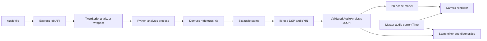

# MotionScore

MotionScore turns a song into an interactive, physics-driven music
visualization. It separates the recording into instrument stems with Demucs,
measures rhythm, pitch, activity, and song structure with librosa, validates the
result, and renders synchronized actors and tracks from the audio timeline.

## Download the Windows application

The current Windows x64 installer is preserved as a GitHub Release asset:

**[Download MotionScore Setup 0.1.0.exe](https://github.com/kamrul28890/motionscore/releases/download/v0.1.0/MotionScore-Setup-0.1.0.exe)**

The application is currently unsigned, so Windows SmartScreen may require
**More info -> Run anyway**. Verify the download before running it:

```text
SHA-256
E78612B633A2F1C833FD043DE4844B0436877BAE0174AFD9CDA64E93DEDDD113
```

The same value is stored in
[`desktop-dist/SHA256SUMS.txt`](desktop-dist/SHA256SUMS.txt).

## Origin and attribution

This project began with
[`BaselAshraf81/lineridervisualizer`](https://github.com/BaselAshraf81/lineridervisualizer)
as its foundation. I modified and extended it with a rebuilt analysis pipeline,
six-source neural stem separation, synchronized multi-stem playback, detailed
progress and validation, scene-authoring controls, a first-run runtime manager,
a Windows desktop application, expanded documentation, tests, and a redesigned
interface.

The upstream repository does not currently contain a license file. Review the
original project's terms and obtain any necessary permission before
redistributing or relicensing derived work.

## What the application provides

- `htdemucs_6s` separation into drums, bass, vocals, guitar, piano, and other
- Individually playable, selectable, downloadable, muteable, and soloable stems
- Multi-stem karaoke playback from one synchronized master timeline
- Live 2D canvas choreography driven by real musical events and activity
- Insight and Performance visualization modes
- Section-aware motion for builds, rises, drops, breakdowns, and falls
- Clickable song minimap with sections, role activity, hits, and playhead
- Per-role names, colors, grouping, height, tilt, visibility, and actor controls
- Live scene legend, state labels, pitch-direction indicators, and diagnostics
- Named progress stages from upload through result encoding
- CUDA acceleration with automatic CPU fallback
- Local analysis: uploaded music does not need to leave the user's computer

The interface has three top-level workspaces:

1. **Live visualization** shows the synchronized animation and musical insight.
2. **Source Lab** plays the original and any combination of separated stems.
3. **Scene Controls** changes how sounds are grouped and represented visually.

The master timeline remains available while switching among all three tabs.

## Architecture

MotionScore is an npm-workspace monorepo with a TypeScript/React application and
a Python audio-analysis subsystem.



| Layer | Responsibility |
|---|---|
| Electron desktop shell | Starts a private local server and opens the application window |
| React client | Upload, progress, playback, tabs, stem mixer, scene controls, and diagnostics |
| Express server | Job lifecycle, Server-Sent Events, runtime setup, result, and audio endpoints |
| TypeScript analyzer wrapper | Starts Python, parses progress, validates output, and creates typed results |
| Python analyzer | Demucs separation, librosa features, pYIN pitch, events, sections, and stem export |
| Shared types | Versioned `AudioAnalysis` contract and runtime validators |
| Scene model and renderer | Converts time-indexed analysis into deterministic paths and canvas frames |

The browser audio element is the master clock. Pausing, seeking, stem playback,
the minimap, and the animation all use the same `currentTime`, preventing the
visualization from drifting away from the song.

For the full stage-by-stage explanation, diagrams, model details, JSON examples,
validation rules, and value-to-animation mappings, read
[`ARCHITECTURE_AND_PIPELINE_GUIDE.md`](ARCHITECTURE_AND_PIPELINE_GUIDE.md).

## Pipeline

| Stage | Operation | Primary output |
|---:|---|---|
| 1 | Accept and validate an audio upload | Temporary source audio |
| 2 | Open the Server-Sent Events progress stream | Named progress updates |
| 3 | Start the TypeScript-to-Python analysis boundary | Analyzer process and output paths |
| 4 | Run `htdemucs_6s` | Six neural source stems |
| 5 | Detect meaningful stem presence | Active role/stem set |
| 6 | Detect attacks and musical events | Time-stamped role events |
| 7 | Track pitched sources with pYIN | Pitch and direction estimates |
| 8 | Build continuous activity and sustain signals | Compact 10 Hz role timelines |
| 9 | Analyze the full mix | Tempo, energy, spectral features, and sections |
| 10 | Encode separated components | Playable stem audio files |
| 11 | Validate and normalize analyzer output | Safe typed `AudioAnalysis` |
| 12 | Publish the job result | Analysis and secured audio URLs |
| 13 | Construct deterministic scene paths | Actors, contacts, rails, arcs, and cues |
| 14 | Render against the master clock | Synchronized interactive visualization |

## Repository tree

```text
motionscore/
|-- desktop/
|   |-- build-server.mjs             # Bundles the Express backend for Electron
|   |-- generated/
|   |   `-- server.mjs               # Committed production server bundle
|   `-- main.mjs                     # Electron lifecycle and private local server
|-- desktop-dist/
|   |-- MotionScore Setup 0.1.0.exe.blockmap
|   |-- SHA256SUMS.txt
|   `-- latest.yml                    # GitHub Release/update metadata
|-- packages/
|   |-- types/
|   |   `-- src/                     # Shared contracts, errors, and validators
|   |-- note-extractor/
|   |   |-- python/
|   |   |   |-- extract_events.py    # librosa/DSP helpers
|   |   |   `-- extract_stems.py     # Demucs and complete analysis pipeline
|   |   `-- src/                     # Python process wrapper and result parsing
|   `-- web/
|       |-- dist/                     # Committed production client/server build
|       `-- src/
|           |-- client/
|           |   |-- src/components/  # UI, mixer, setup, legend, and controls
|           |   `-- src/scene2d/     # Scene construction and canvas rendering
|           |-- runtime-manager.ts   # Private first-run Python/audio runtime
|           `-- server.ts            # Express API and job lifecycle
|-- scripts/
|   |-- setup.ps1                    # Windows source-development setup
|   `-- setup.sh                     # Unix source-development setup
|-- test/                            # Server, progress, runtime, and scene tests
|-- ARCHITECTURE_AND_PIPELINE_GUIDE.md
|-- MEMORY.md                        # Maintainer-oriented codebase map
|-- package.json                     # Workspaces, build, test, and desktop config
|-- package-lock.json
`-- README.md
```

Generated environments, downloaded models, uploads, stems, secrets, IDE
settings, and machine-specific runtime metadata are intentionally excluded.
Large executables are published as GitHub Release assets instead of Git blobs:
the installer remains directly downloadable without making every source clone
carry its binary history. The 225+ MiB `win-unpacked/MotionScore.exe` is omitted
because it exceeds GitHub's normal per-file limit and is reproducible from
source.

## Running the Windows installer

1. Download `MotionScore Setup 0.1.0.exe`.
2. Verify its SHA-256 value against `desktop-dist/SHA256SUMS.txt`.
3. Run the installer.
4. If SmartScreen appears, select **More info -> Run anyway**.
5. On first launch, select the CPU or NVIDIA GPU analysis runtime.

The first-run manager installs a private copy of Python, PyTorch, torchaudio,
Demucs, librosa, FFmpeg, and the `htdemucs_6s` model under the user's application
data directory. It does not change the system `PATH` and does not require
administrator access. The runtime requires internet access and several
gigabytes of disk space.

## Running from source

Requirements:

- Node.js 20 or newer
- Python 3.10 or newer
- FFmpeg
- Optional NVIDIA CUDA-capable GPU

Windows setup:

```powershell
npm install
.\scripts\setup.ps1
npm run web:build
npm run web:start
```

Open [http://localhost:3001](http://localhost:3001).

For CPU-only setup:

```powershell
.\scripts\setup.ps1 -Cpu
```

Run the desktop application from source:

```powershell
npm run desktop:dev
```

## Development and release commands

```powershell
# Development server
npm run web:dev

# TypeScript checks and automated tests
npm run typecheck
npm test

# Production browser/server build
npm run web:build

# Reproducible unpacked desktop directory
npm run desktop:dir

# Windows NSIS installer
npm run desktop:build
```

The repository contains the production web build, bundled desktop server,
installer metadata, blockmap, and checksum. The matching installer is attached
to GitHub release `v0.1.0`. Dependency folders and Python environments must
always be recreated locally.

## Current release verification

The committed `0.1.0` installer was produced on Windows x64 and checked with:

- 31 passing Vitest tests across 5 test files
- successful TypeScript project checks
- successful Vite and Electron Builder production builds
- successful NSIS archive integrity test
- packaged application launch and HTTP 200 UI smoke test
- ready Python, PyTorch CUDA, FFmpeg, and NVIDIA runtime status

The installer is not Authenticode-signed. The checksum verifies that a downloaded
file matches this repository's release artifact, but it is not a substitute for
a trusted publisher signature.

## Runtime behavior and privacy

- Analysis runs locally.
- Temporary uploads and generated stems are removed after the server's retention
  period.
- Stem separation is an estimate; bleed and separation artifacts are expected.
- The first analysis may take longer while the model and runtime are downloaded.
- CPU processing works but is substantially slower than supported NVIDIA CUDA
  processing.
